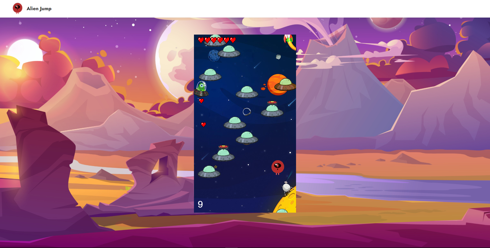

# Alien Jump

## Game Overview and Logic
Alien Jump is a classic game in which the alien tries to jump to earn points by jumping. On your way there will be enemies who will be there to stop you, be careful because if they hit you, it's game over

## Functionality
In Alien Jump, you will be able to
* Consult the rules of the game
* Go see what's in the store
* Go left and right
* To be able to jump on trampolines to go higher

## This project uses the following technologies:
* JavaScript
* HTML5 (Canvas)

## Starting the game
To run the code, download the Live Server extension on VS Code, then right click on index.html and click on Open with Live Server